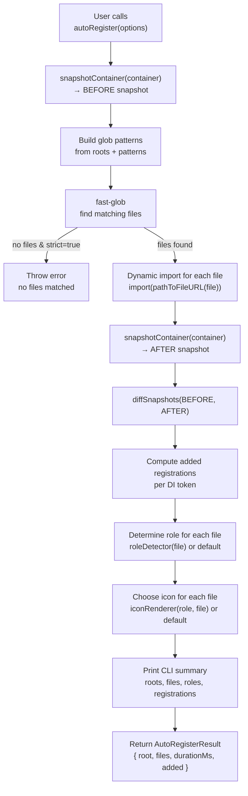
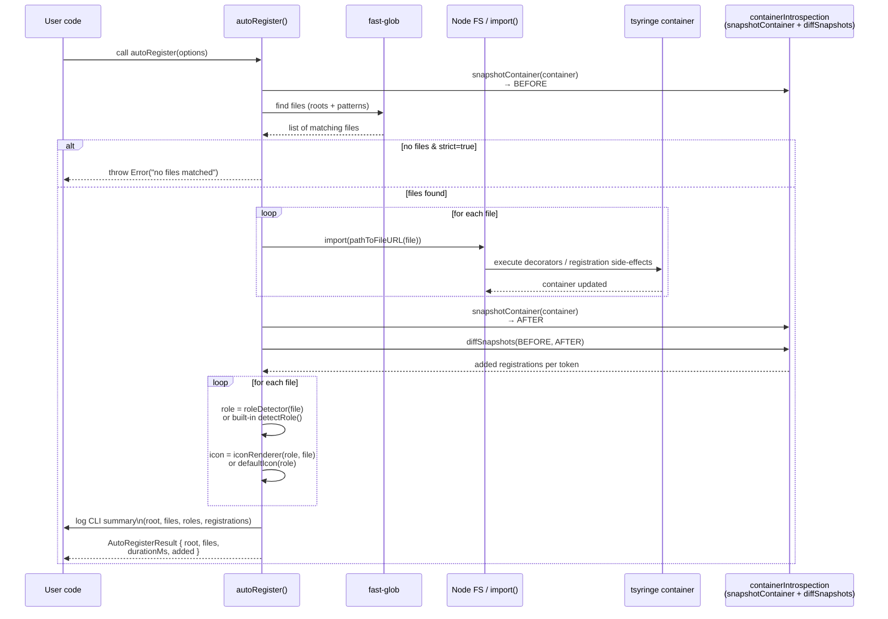

# 🌟 @justedou/tsyringe-auto-register

> **Automatic dependency registration for `tsyringe` — scan, import (side effect), introspect & visualize your DI container.**

[](https://www.npmjs.com/package/@justedou/tsyringe-auto-register) [](LICENSE)  

A lightweight, elegant utility that **automatically imports and registers all your dependency files** (`services`, `controllers`, `repositories`, etc.) into a `tsyringe` container — with **customizable role detection**, **custom icons**, and **deep introspection** of your DI graph.

This library is ideal for:

- Clean project bootstraps
- Auto-wiring domains
- Dependency visualization tools
- Debugging `tsyringe` internals
- Reducing repetitive manual registration

> ⚠️ This tool relies on **internal tsyringe APIs** (`_registry`).  
> Perfect for tooling/debugging, not guaranteed to stay API-stable.

---

## 📚 Table of Contents

- [Features](#-features)
- [Installation](#-installation)
- [Quick Start](#-quick-start)
- [Custom Role Detection](#-custom-role-detection)
- [Custom CLI Icons](#-custom-cli-icons)
- [Full API](#-full-api)
- [Container Introspection](#-container-introspection)
- [How auto-registration works](#-how-auto-registration-works)
- [Performance Notes](#-performance-notes)
- [Supported tsyringe versions](#-supported-tsyringe-versions)
- [FAQ](#-faq)
- [License](#-license)

---

## ✨ Features

- 🔍 **Auto-scan** your project for DI-related files
- 🤖 **Automatic imports** → triggers decorators → registers into tsyringe
- 🧭 **Pluggable role detection** using free-form strings
- 🎨 **Custom CLI icons** for pretty terminal output
- 🧠 **Snapshot & diff** your DI container before/after scanning
- ⚡ Compatible with **ESM** & **CommonJS**
- 📂 Fully customizable glob patterns
- 🛠 Great for CLIs, DX tooling, domain bootstraps

---

## 📦 Installation

```bash
npm install @justedou/tsyringe-auto-register tsyringe reflect-metadata
```

Add the required TS options:

```jsonc
// tsconfig.json
{
  "compilerOptions": {
    "experimentalDecorators": true,
    "emitDecoratorMetadata": true
  }
}
```

---

## 🚀 Quick Start

```ts
import "reflect-metadata";
import { container } from "tsyringe";
import { autoRegister } from "@justedou/tsyringe-auto-register";

async function bootstrap() {
  await autoRegister({
    roots: ["src"],
    strict: true,
    container,
  });

  // const app = container.resolve(App);
  // app.start();
}

bootstrap();
```

Output example:

```text
DI auto-registration — 14 files scanned (42ms)
✔ class UserService → useClass { UserService }
✔ token "Logger" → useValue { ConsoleLogger }
• src/modules/health/health.controller.ts (controller)
```

---

## 🧭 Custom Role Detection

You can define **your own logic** to categorize files (e.g., DDD folders).

```ts
import {
  autoRegister,
  type RoleDetector,
} from "@justedou/tsyringe-auto-register";

const roleDetector: RoleDetector = (file) => {
  if (file.includes("/controllers/")) return "controller";
  if (file.includes("/services/")) return "service";
  if (file.includes("/repositories/")) return "repository";
  return "other";
};

await autoRegister({ roleDetector });
```

---

## 🎨 Custom CLI Icons

```ts
import {
  autoRegister,
  type IconRenderer,
} from "@justedou/tsyringe-auto-register";

const iconRenderer: IconRenderer = (role) => {
  switch (role) {
    case "controller":
      return "🎮";
    case "service":
      return "⚙️";
    case "repository":
      return "💾";
    default:
      return "•";
  }
};

await autoRegister({ iconRenderer });
```

---

## 🧩 Full API

```ts
export type RoleDetector = (file: string) => string;
export type IconRenderer = (role: string, file: string) => string;

export interface ScanOptions {
  roots?: string[];
  patterns?: string[];
  strict?: boolean;
  container?: import("tsyringe").DependencyContainer;
  roleDetector?: RoleDetector;
  iconRenderer?: IconRenderer;
}
```

---

## 🔬 Container Introspection

_Debug your DI container like a pro._

```ts
import { snapshotContainer } from "@justedou/tsyringe-auto-register";

const before = snapshotContainer(container);
// ...register stuff...
const after = snapshotContainer(container);

console.log(after.byToken);
```

This helps you track:

- registered tokens
- provider type (`useClass`, `useValue`,…)
- factory return types (best effort)
- diffs between two snapshots

Perfect for debugging complex systems.

---

## 🔁 How auto-registration works

### Flowchart



> `autoRegister()` takes a snapshot of the container before and after importing all matching files, computes the diff, annotates each file with a role and icon, prints a CLI summary, and returns a typed result describing the added registrations.

### 📡 Interactions between components



### 🧠 Internal building blocks

| Function / hook                                    | What it does                                                                            | When to keep the default                                                                      | When to customize / override                                                                                 |
| -------------------------------------------------- | --------------------------------------------------------------------------------------- | --------------------------------------------------------------------------------------------- | ------------------------------------------------------------------------------------------------------------ |
| `autoRegister(options)`                            | Orchestrates the whole flow: snapshot → scan → import → snapshot → diff → log → return. | Almost always. This is the main entry point your app should call.                             | Rarely. Only if you need a completely different flow or want to wrap it with extra behaviors (timers, logs). |
| `snapshotContainer(container)`                     | Reads the internal `tsyringe` registry (`_registry`) and builds a normalized snapshot.  | Always, unless you know **exactly** how tsyringe internals work and want your own view.       | If you need a custom snapshot format for tooling, visualizers, or exporting the DI graph in another shape.   |
| `diffSnapshots(before, after)`                     | Compares two snapshots and extracts **which registrations were added** per token.       | Always. The built-in diff is enough for most use cases.                                       | If you want to track removals, changes, or build a more advanced timeline of container evolution.            |
| `RoleDetector` (default: `detectRole`)             | Maps a file path (string) to any free-form “role” label (e.g. `controller`, `service`). | If your project follows the default naming: `.controller.`, `.service.`, `.repository.`, etc. | When you have a custom folder structure (DDD, feature-based, multi-module) and want domain-specific roles.   |
| `IconRenderer` (default: `defaultIcon`)            | Maps a `role` + `file` to a CLI icon (glyph). Only affects **terminal output**.         | If you’re fine with simple, colored ASCII-like icons.                                         | When you want emojis, different shapes per domain, or completely different symbols for your own CLI style.   |
| `getClassName` / `introspectFactoryReturnTypeName` | Best-effort human label for providers (class name, factory result, etc.).               | When you just want readable logs and don’t care about exact type naming.                      | If you need **stable IDs**, custom naming conventions, or want to hide internal implementation details.      |

---

## ⚡ Performance Notes

- Scanning uses `fast-glob` → extremely fast
- The cost comes from **dynamic imports** (one per matched file)
- Works best when used during **startup**, not per-request
- For large projects: restrict `patterns` and `roots` for optimal performance

---

## ✔️ Supported tsyringe versions

This library is tested and validated with:

- **tsyringe ≥ 4.0**
- **Node.js ≥ 18**
- **TypeScript ≥ 5.0**

It relies on internal `tsyringe` fields such as `container._registry`, which have been stable since `tsyringe 4.x`.

### Compatibility policy

- Minor and patch versions of tsyringe (`4.x.y`) are fully supported.
- Breaking changes may happen if the internal registry structure changes in future major tsyringe releases (e.g., `5.0`).
- If you upgrade tsyringe and something changes internally, you can **override the snapshot & diff functions** to adapt to future API changes.

If you want official compatibility with tsyringe `5.x` once it releases, feel free to open an issue or submit a PR.

---

## ❓ FAQ

### Does this replace manual registration?

It **automates** manual registration, but you can still mix both.

### Does this work with classes without decorators?

No — tsyringe requires decorators for automatic registration.

### Can this break if tsyringe internals change?

Yes. `_registry` is an internal API.

### Does it support monorepos?

Yes, as long as you pass multiple `roots`.

### Does it work with Bun or Deno?

Only Node for now (uses `import()` + Node path tools).

---

## 📄 License

MIT — feel free to use it in commercial or open-source projects.
